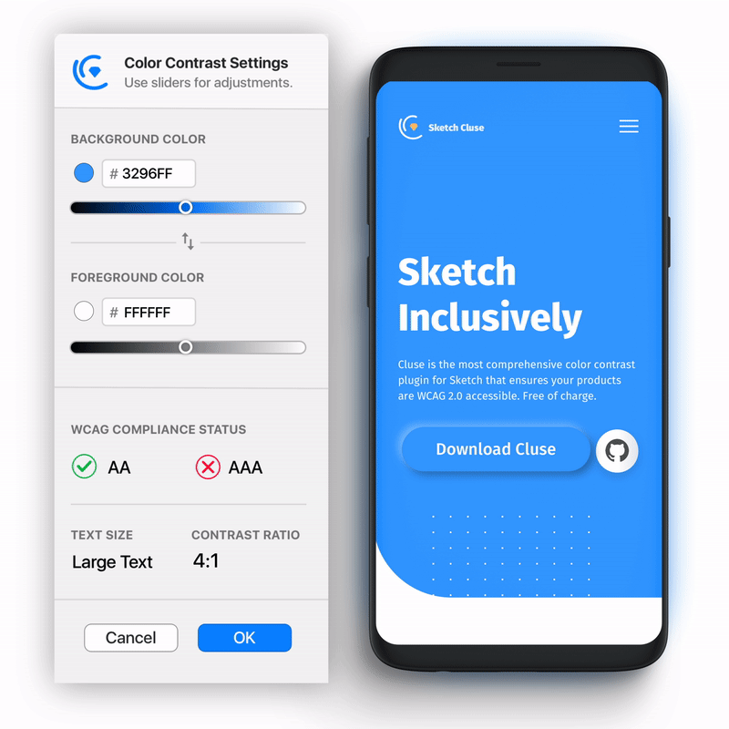

<h1 align="center">
  
 
  <h1 align="center">Cluse</h1>
  

    
    

    
  

</h1>

    
    
    

# 
A Sketch plugin to check color contrast for web accessibility based on [WCAG 2.0](https://www.w3.org/TR/WCAG20/). Fitting seamlessly into your team's workflow, [Cluse](https://cluse.cc) allows you to remotely change your design and see the updated WCAG score live. 

## Installation

### Manually

1.  Download the [latest release](https://github.com/ygev/cluse/releases/download/v1.1.0/Cluse.sketchplugin.zip)
2.  Open `Cluse.sketchplugin`

## Usage
  
1.  Select two layers you want to check.
2.  Launch `Plugins › 🔹Cluse` or press  `⌘`+ `⇧ Shift` + `C`
3.  Adjust your colors using the sliders until you pass WCAG!

  

Cluse is available under the GPL 3.0 license. See the LICENSE file for more info.
